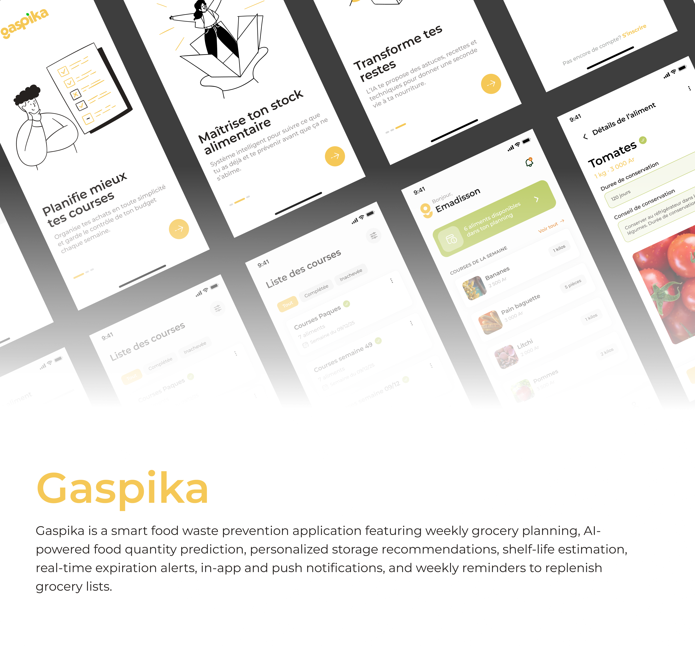

# Gaspika

Gaspika is a mobile application that helps households reduce food waste. Users build weekly shopping lists, track the food they already own, and get notified before an item reaches its expiration date. The app relies on machine learning models to predict how long a food item can be kept and the quantity worth buying, so users shop for what they actually need. It is built as a monorepo with a Flutter mobile app, a FastAPI backend, and the trained ML models.

## Link for Video demo

[Click to see demo](https://drive.google.com/file/d/1zC7e_3jmtBq5HtJbQv2Z-q7qqWJzwpzZ/view?usp=sharing)

## Features

### Mobile app

- [x] Onboarding screens
- [x] Sign up and login with JWT authentication
- [x] Weekly shopping lists: generation, update, deletion
- [x] Shopping list filters
- [x] Add food items with a photo, autocomplete, quantity and unit
- [x] Quantity, shelf life and storage tips suggested by the prediction models when adding an item
- [x] Mark an item as purchased, update or delete it
- [x] Food details with estimated shelf life
- [x] Home screen with the available food of the week
- [x] Push notifications with unread counter, read and delete actions
- [x] Settings: account information, password, notification preferences, account deletion

### Backend

- [x] REST API with Swagger documentation
- [x] JWT authentication and bcrypt password hashing
- [x] PostgreSQL with async SQLAlchemy and Alembic migrations
- [x] Redis caching
- [x] Scheduled notifications: expiration alerts and end-of-week list reminders
- [x] Push notifications through Firebase Cloud Messaging
- [x] Image upload to ImgBB
- [x] Account deletion with soft delete and personal data purge
- [x] Docker Compose setup for the API, PostgreSQL and Redis
- [x] ML models served as prediction endpoints for food shelf life and recommended quantity
- [x] Predicted shelf life sav

## Tech stack

|             |                                                                                 |
| ----------- | ------------------------------------------------------------------------------- |
| **Mobile**  | Flutter, Riverpod, GoRouter, Dio, Hive, Freezed                                 |
| **Backend** | NestJS, Drizzle ORM, PostgreSQL, Redis, Supabase Storage, Nodemailer, Infisical | ed on the item and used to schedule its expiration notification |

